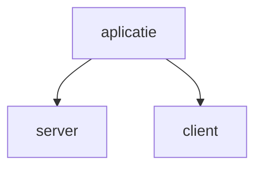
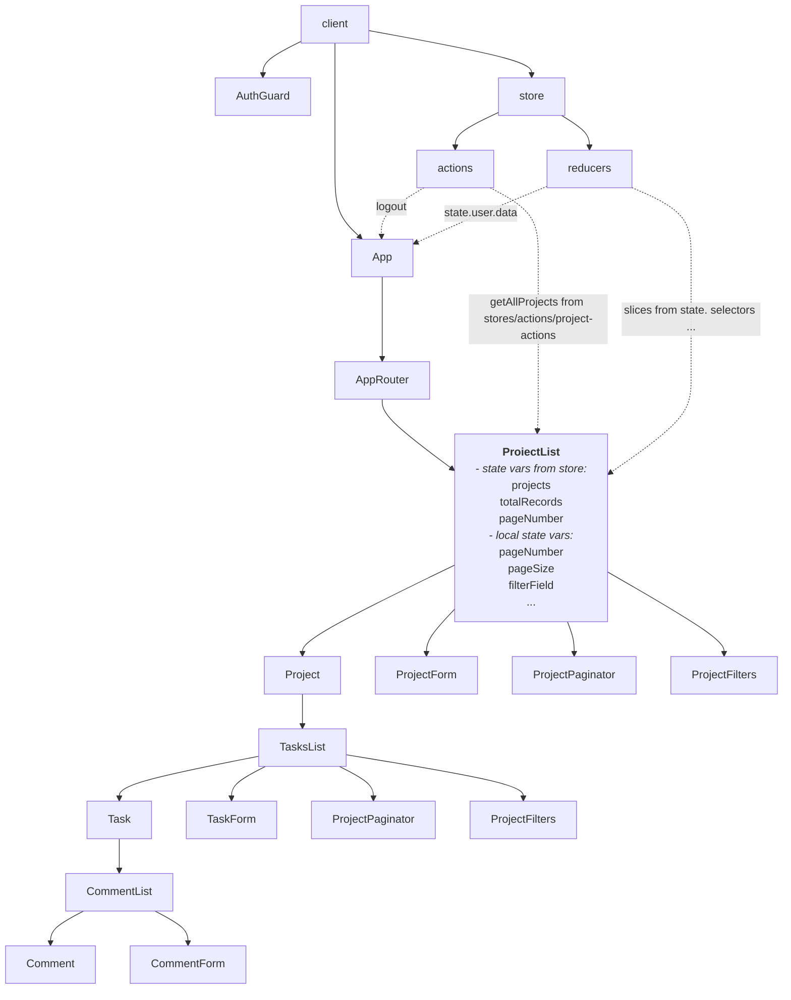

# Aplicatie web frontend - backend
- fronend (client) - REACT + Redux pentru gestionarea starii aplicatiei
- backend (RESTAPI server) - nodeJS si Express + SQLite (pentru baza date) + Sequelize (ORM)


## Cuprins
<!-- omit in toc -->

1. [Structura aplicatie - frontend si backend](#structura-aplicatie---frontend-si-backend)
1. [Structura client](#structura-client)
1. [Verifica daca utilizatorul este autentificat pentru la accesarea unei resurse](#verifica-daca-utilizatorul-este-autentificat-pentru-la-accesarea-unei-resurse)
1. [A. In Router](#a-in-router)
1 [B. Verificare in `AuthGuard`](#b-verificare-in-authguard)
1. [Explicare accesare date de stare din `store` sau mai precis din `reducers` din `store`](#explicare-accesare-date-de-stare-din-store-sau-mai-precis-din-reducers-din-store)
1. [Exemplu - Componenta ProjectsList](#exemplu---componenta-projectslist)
1. [Legatura cu backend-ul](#legatura-cu-backend-ul)
1. [Tipuri de actiuni din reducers - extra actiuni, nedefinite generate datorita lucrului asincron](#tipuri-de-actiuni-din-reducers---extra-actiuni-nedefinite-generate-datorita-lucrului-asincron)




### Structura aplicatie - frontend si backend
[Cuprins](#cuprins)
<table>
<tr>
<td style="vertical-align:top;">

```bash
server
    ├── middleware
    │   ├── assigned-task-middleware.mjs
    │   ├── auth-middleware.mjs
    │   ├── generic-error-middleware.mjs
    │   ├── index.mjs
    │   ├── perm-middleware.mjs
    │   └── user-type-middleware.mjs
    ├── models
    │   ├── index.mjs
    │   ├── permission.mjs
    │   ├── project.mjs
    │   ├── task_comment.mjs
    │   ├── task.mjs
    │   └── user.mjs
    ├── node_modules
    ├── orig-package-lock.json
    ├── package.json
    ├── package-lock.json
    ├── routers
    │   ├── admin-router.mjs
    │   ├── api-router.mjs
    │   ├── auth-router.mjs
    │   ├── controllers
    │   └── index.mjs
    └── server.mjs
```

</td>
<td>

```bash
client
    ├── eslint.config.js
    ├── index.html
    ├── node_modules
    ├── package.json
    ├── package-lock.json
    ├── public
    │   └── vite.svg
    ├── README.md
    ├── src
    │   ├── components
    │   │   ├── App
    │   │   │   ├── App.css
    │   │   │   ├── App.jsx
    │   │   │   └── index.js
    │   │   ├── AuthGuard
    │   │   │   ├── AuthGuard.jsx
    │   │   │   └── index.js
    │   │   ├── Dashboard
    │   │   │   ├── Dashboard.css
    │   │   │   ├── Dashboard.jsx
    │   │   │   ├── index.js
    │   │   │   ├── User.jsx
    │   │   │   └── UsersList.jsx
    │   │   ├── ErrorDisplay
    │   │   │   ├── ErrorDisplay.css
    │   │   │   ├── ErrorDisplay.jsx
    │   │   │   └── index.js
    │   │   ├── LoginForm
    │   │   │   ├── index.js
    │   │   │   ├── LoginForm.css
    │   │   │   └── LoginForm.jsx
    │   │   ├── Paginator
    │   │   │   ├── index.js
    │   │   │   ├── Paginator.css
    │   │   │   └── Paginator.jsx
    │   │   ├── ProjectForm
    │   │   │   ├── index.js
    │   │   │   └── ProjectForm.jsx
    │   │   ├── ProjectList
    │   │   │   ├── index.js
    │   │   │   ├── Project
    │   │   │   ├── ProjectList.css
    │   │   │   └── ProjectList.jsx
    │   │   ├── TaskCommentForm
    │   │   │   ├── index.js
    │   │   │   └── TaskCommentForm.jsx
    │   │   ├── TaskCommentList
    │   │   │   ├── index.js
    │   │   │   ├── TaskComment
    │   │   │   ├── TaskCommentList.css
    │   │   │   └── TaskCommentList.jsx
    │   │   ├── TaskDetails
    │   │   │   ├── index.js
    │   │   │   ├── TaskDetails.css
    │   │   │   └── TaskDetails.jsx
    │   │   ├── TaskForm
    │   │   │   ├── index.js
    │   │   │   └── TaskForm.jsx
    │   │   └── TaskList
    │   │       ├── index.js
    │   │       ├── Task
    │   │       ├── TaskList.css
    │   │       └── TaskList.jsx
    ├── config
    │   └── global.js
    ├── index.css
    ├── main.jsx
    └── stores
        ├── actions
        │   ├── index.js
        │   ├── project-actions.js
        │   ├── task-actions.js
        │   ├── taskcomment-actions.js
        │   ├── user-actions.js
        │   ├── users-actions.js
        │   └── user-suggestion-actions.js
        ├── reducers
        │   ├── index.js
        │   ├── project-reducer.js
        │   ├── taskcomment-reducer.js
        │   ├── task-reducer.js
        │   ├── user-reducer.js
        │   ├── users-reducer.js
        │   └── user-suggestion-reducer.js
        └── store.js
```
</td>
</tr>
</table>

### Structura client
[Cuprins](#cuprins)




### Verifica daca utilizatorul este autentificat pentru la accesarea unei resurse
[Cuprins](#cuprins)

#### A. In Router
[Cuprins](#cuprins)
- Elementul rutei, are continutul util (`ProjecList` in exemplul de mai jos) incapsulat in elementul `AuthGuard`
- `AuthGuard` primeste ca `props` valoarea `isAuthenticated` iar ca `children` componenta `ProjectList` - lista de proiecte
```jsx
//client/src/components/App.jsx (fragment)
    // selectors
    const userDataSelector = state => state.user.data


    const App = () => {
        const dispatch = useDispatch()
        const userData = useSelector(userDataSelector)
        console.log("App: userData:", userData)

        const isAuthenticated = !!userData.token

        return (
            ...

            <Router>
                <Routes>
                <Route
                    path='/projects'
                    element={
                        <AuthGuard isAuthenticated={isAuthenticated}>
                            <ProjectList />
                        </AuthGuard>
                    }
                    />
                ...
                </Routes>
            </Router>
        ...
        )
    }
```

### B. Verificare in `AuthGuard`
[Cuprins](#cuprins)
- daca utilizatorul nu are token in baza de date - considerat a nu fi autentificat in cazul de fata
- `AuthGuard` redirectioneaza catre ruta `/login`
- altfel afiseaza `children`

```jsx
//client/src/components/AuthGuard.jsx (fragment)
import React from 'react'
import { Navigate, useLocation } from 'react-router-dom'

const AuthGuard = ({ children, isAuthenticated }) => {
  const location = useLocation()
  console.log("AuthGuard: location - cu useLocation():", location)

  if (!isAuthenticated) {
    // Redirect to login page and preserve the current location in state
    return <Navigate to='/login' state={{ from: location }} replace />
  }

  // If authenticated, render the children (protected component)
  return children
}

export default AuthGuard
```

### Explicare accesare date de stare din `store` sau mai precis din `reducers` din `store`
[Cuprins](#cuprins)
- se foloseste redux
- starea gestionata cu redux se afla in obiectul `state`
- obiectul state are sectiuini specifice care pot fi selectate cu `useSelector`
- obiectul `state` nu este definit explicit in `store`
- in fiecare fisier `reducer` avem initializata sectiunea de date specifica acelui reducer
- pe langa date, fiecare fisier reducer defineste functia reducer si blocul `switch - case` de analiza a actiunii si generare a noii stari
- componentele aplicatiei - ex: `ProjectList`, `Project`, `TaskList`, etc. selecteaza explicit sectiunea din `state` pe care o acceseaza
- datele selectate devin disponibile in componente


#### Exemplu - Componenta ProjectsList
[Cuprins](#cuprins)
- se utilizeaza dispatch din react-redux: `dispatch = useDispatch()`
- variabilele [infoDate]Selector specifica ce se selecteaza din starea gestionata de redux
- cu useSelelctor - se creaza variabilele din componenta conectate la starea din `store`
- incarcarea datelor se face prin intermediul apelului `useEffect`
  - verifica daca avem `userId` - daca utilizatorul este conectat
  - defineste functia asincrona `loadProjects`
    - genereaza `action` prin apelul `getAllProjects` cu parametrii din interfata grafica sau cei impliciti
    - actiunea `action` este un obiect cu doua atribute: `type` si `payload`
    - apeleaza `dispatch(action)`
    - apelul dispatch - apeleaza `reducer`-urile specifice - in acest caz pentru project

```jsx
//client/src/components/ProjectList.jsx (fragment)
// selectors
const projectDataSelector = state => state.project.data
const projectCountSelector = state => state.project.count
const userIdSelector = state => state.user.data.id

const ProjectList = () => {
  const dispatch = useDispatch()
  const navigate = useNavigate()

  const projects = useSelector(projectDataSelector)
  const totalRecords = useSelector(projectCountSelector)
  const userId = useSelector(userIdSelector)

  const [pageNumber, setPageNumber] = useState(0)
  const [pageSize, setPageSize] = useState(10)
  const [filterField, setFilterField] = useState('')
  const [filterValue, setFilterValue] = useState('')
  const [sortField, setSortField] = useState('')
  const [sortOrder, setSortOrder] = useState('')

  useEffect(() => {
    if (!userId) {
      return
    }

    const loadProjects = async () => {
      const action = await getAllProjects(userId, {
        pageNumber,
        pageSize,
        filterField,
        filterValue,
        sortField,
        sortOrder
      })
      dispatch(action)
    }

    loadProjects()
  }, [dispatch, userId, pageNumber, pageSize, filterField, filterValue, sortField, sortOrder])
  ...
```

### Reducere-le combinate
Toate functiile reducer sunt combinate intr-un reducer global: `rootReducer`.
Acest lucru se face in fisierul `index.js` din `store/reducers`
Root reducer-ul este importat apoi in `stores/store.js`

Combinatorul de reducers ia ca argument un dictionar.
In aplicatie conteaza cheia, de exemplu, pentru a apela reducer-ul `project` pentru datele specifice proiectului, conteaza ca avem asocierea: `project: projectReducer` in dictionarul generat cu `combineReducers`

**Cheia din rootReducer TREBUIE sa coincida cu sectiune de date (slice-ul) folosit in selector in cod.**

```jsx
//client/store/reducers/index.js
import { combineReducers } from 'redux'
import projectReducer from './project-reducer'
import taskReducer from './task-reducer'
import userReducer from './user-reducer'
import userSuggestionReducer from './user-suggestion-reducer'
import taskCommentReducer from './taskcomment-reducer'
import usersReducer from "./users-reducer"

const rootReducer = combineReducers({
  project: projectReducer,
  task: taskReducer,
  taskcomment: taskCommentReducer,
  user: userReducer,
  userSuggestion: userSuggestionReducer,
  users: usersReducer
})

export default rootReducer
```


### Legatura cu backend-ul
[Cuprins](#cuprins)
Datele sunt solicitate de la backend in actiuni - definite in fisierele `store/[categorie]-actions.js`.

Exemplu: functia `getAllProjects` din `stores/actions/project-action.js`
(nota: fisierele sunt doar js, nu jsx - nu contin HTML + JS + CSS, doar js)

- functia este una asincrona
- primeste ca parametrii userId-ul si un dictionar cu numarul paginii, dimensiunea paginii, informatiile de filtrare, sortare
- se folosest sintaxa de destructurare - avem un dictionar unde initializam argumentele de care avem nevoie
- implicit dictionarul este gol, dar pentru ca am folosit sintaxa de destructurare putem accesa cu valorile default parametrii: `pageNumber` etc
- se obtine token-ul - necesar pentru conexiunea autentificata backend-ul REST API
  - `const token = store.getState().user.data.token`
- se construieste URL-ul - aici folosim variabila `{SERVER}` la care adaugam calea si parametrii (query params)
- se genereaza obiectul actiune in return, cu cele 2 componente
  - type (in cazul acestui exemply: `GET_ALL_PROJECTS`)
  - payload - o functie asincrona care acceseaza backend-ul REST API: `... fetch(URL, {headers: {authorization: token}})`

```js
//client/stores/actions/project-actions.js
import store from '../store'
import { SERVER } from '../../config/global'

// options: { pageNumber, pageSize, filterField, filterValue, sortField, sortOrder }
export const getAllProjects = async (
  userId,
  {
    pageNumber = '',
    pageSize = '',
    filterField = '',
    filterValue = '',
    sortField = '',
    sortOrder = ''
  } = {}
) => {
  const token = store.getState().user.data.token

  const url = `${SERVER}/api/users/${userId}/projects` +
    `?pageSize=${pageSize || ''}` +
    `&pageNumber=${pageNumber === '' ? 0 : pageNumber}` +
    `&filterField=${filterField || ''}` +
    `&filterValue=${filterValue || ''}` +
    `&sortField=${sortField || ''}` +
    `&sortOrder=${sortOrder || ''}`

  return {
    type: 'GET_ALL_PROJECTS',
    payload: async () => {
      let response = await fetch(url, {
        headers: {
          authorization: token
        }
      })
      if (!response.ok) {
        throw response
      }
      // expected: { data, count }
      return response.json()
    }
  }
}
```

### Tipuri de actiuni din reducers - extra actiuni, nedefinite generate datorita lucrului asincron
[Cuprins](#cuprins)
In fisierul actiune de mai sus am definit doar actiunea cu tipul `GET_ALL_PROJECTS`.
La executia programului, datorita modului de lucru asincron, se genereaza 3 tipuri de actiuni automat - nu trebuie definite in cod in actions dar trebuie tratate in reducer:

- `GET_ALL_PROJECTS_PENDING`
- `GET_ALL_PROJECTS_FULFILLED`
- `GET_ALL_PROJECTS_REJECTED`


```js
//client/stores/reducers/project-reducer.js (fragment)
export default function projectReducer(state = initialState, action) {
  switch (action.type) {
    // any request
    case `GET_ALL_PROJECTS_PENDING`:
    case `CREATE_PROJECT_PENDING`:
    case `UPDATE_PROJECT_PENDING`:
    case `DELETE_PROJECT_PENDING`:
      return {
        ...state,
        loading: true,
        error: null
      }

    // any success – payload is always { data, count } because we re-fetch the list
    case `GET_ALL_PROJECTS_FULFILLED`:
    case `CREATE_PROJECT_FULFILLED`:
    case `UPDATE_PROJECT_FULFILLED`:
    case `DELETE_PROJECT_FULFILLED`:
      return {
        ...state,
        loading: false,
        error: null,
        data: action.payload.data,
        count: action.payload.count
      }

    // any error
    case `GET_ALL_PROJECTS_REJECTED`:
    case `CREATE_PROJECT_REJECTED`:
    case `UPDATE_PROJECT_REJECTED`:
    case `DELETE_PROJECT_REJECTED`:
      return {
        ...state,
        loading: false,
        error: action.payload || action.error || 'Project error'
      }

    default:
      return state
  }
}
```